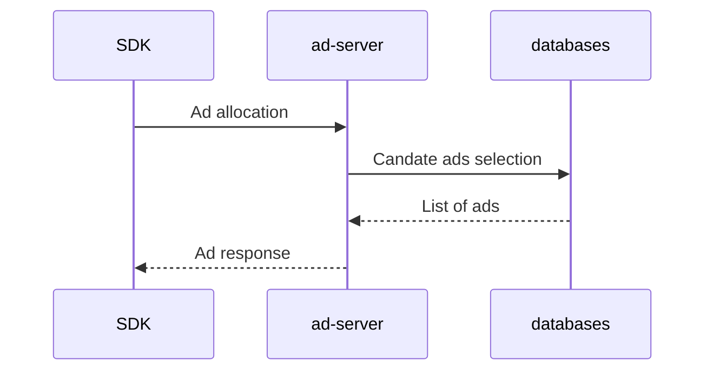
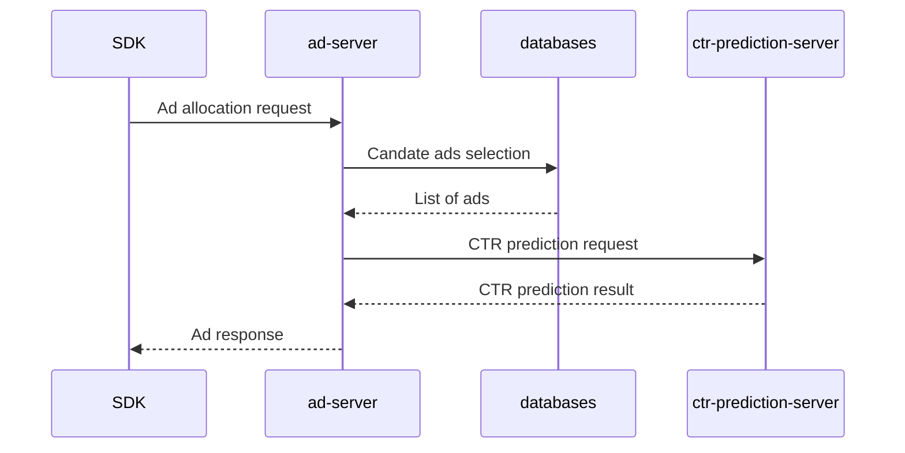
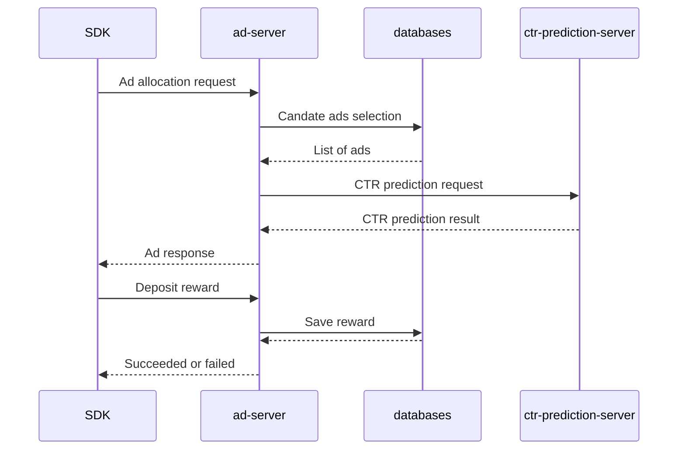

# Overview
본 과제의 목표는 간단한 리워드 광고 서버를 만드는 것입니다. 주어진 기획과 기본적인 아키텍처에 따라 API 설계, 데이터베이스 선택 및 데이터 스키마 정의, 애플리케이션 로직 구현 및 문서화를 수행합니다.

# PART 1. 간단한 광고 서버 구현하기
버즈빌은 리워드 광고를 위한 모바일 SDK를 제공하고 있습니다. 광고지면 보게 될 유저는 SDK를 통해서 서버에 광고 송출 요청을 보내 광고의 리스트를 반환받습니다.



광고 데이터는 [ad_campaigns.json](./resources/ad_campaigns.json) 파일에서 확인할 수 있습니다. 사용하실 데이터베이스에 주어진 파일을 임포트 하여 사용합니다. 파일에는 다음과 같은 정보가 담겨있습니다.

| Key              | Value                                                                  |
| ---------------- | ---------------------------------------------------------------------- |
| id               | 광고를 구분하는 고유 아이디.                                                  |
| name             | 광고의 이름                                                               |
| image_url        | 유저에게 보일 광고의 이미지 주소.                                              |
| landing_url      | 광고를 클릭했을 때 최종으로 유저가 랜딩 되어야 할 광고주 페이지.                       |
| weight           | 캠페인의 송출 가중치로 값이 클수록 첫 번째에 보일 확률이 높습니다.                     |
| target_country   | 광고가 송출 가능한 국가 정보입니다.                                             |
| target_gender    | 광고의 성별 타게팅 정보입니다. M: 남자 타게팅, F: 여자 타게팅                       |
| reward           | 광고를 클릭했을 때 받을 수 있는 리워드입니다.                                     |

## 과제 1
광고 송출 API를 구현합니다. 

광고 송출 요청은 다음과 같은 정보가 포함됩니다.

- 유저의 id (Integer)
- 유저의 성별
- 유저의 국가

광고 송출에 대한 응답에는 다음과 같은 정보가 포함됩니다. 

- 광고의 image_url
- 광고의 landing_url
- 광고의 reward

광고 송출은 다음과 같은 조건을 만족해야 합니다.

- 광고 정보의 country, gender 조건에 맞는 광고만 송출됩니다.
- 광고는 한 번에 최대 3개까지 송출이 되며 3개의 순서는 weight 값에 의해 정해집니다. 만약 광고 a, b, c, d의 각 weight가 1, 1, 2, 3인 경우 a는 1/7, b는 1/7, c는 2/7의, d는 3/7의 확률로 처음에 위치해야 합니다.

# PART 2. 추천 로직 구현하기
PART 1에서는 광고의 송출 순서를 weight 값에 기반하여 정하였습니다. 광고의 효율을 높이기 위해서는 유저가 관심이 있어 할 만한 광고를 먼저 보여주는 것이 좋습니다. 이를 위해 광고가 노출됐을 때 실제로 클릭할 확률인 CTR(Click-Through Rate)을 예측해주는 ctr-prediction-server를 도입했습니다. 



ctr-prediction-server의 사용 방법은 다음과 같은 샘플 요청/응답을 보고 파악합니다.

샘플 요청
```
https://predict-ctr-pmj4td4sjq-du.a.run.app/?user_id=11324&ad_campaign_ids=23,44,58
```

샘플 응답
```json
{
    "pctr": [
        0.010920662874148135,
        0.0427661282076513,
        0.02758501891864686
    ]
}
```

CTR 기반의 광고 추천 로직을 포함하여 여러 가지 광고 순서를 정하는 정책이 존재합니다. 다음과 같은 정책들이 있습니다.

| 이름 | 설명 |
| - | - |
| random | 랜덤으로 정렬하는 정책 |
| weight | PART 1에서 구현한 weight 기반의 정책 |
| pctr | 예측된 CTR의 내림차순으로 정렬하는 정책 |
| weight_pctr_mixed | 예측된 CTR이 가장 높은 광고를 첫 번째에 위치하고 나머지 두 광고는 weight 기반으로 정렬하는 정책 |

## 과제 2
위의 설명을 바탕으로 광고 송출 로직을 개선합니다. 광고 송출 시 user_id 값을 4로 나눈 나머지 값에 따라 정책을 선택합니다. 즉 유저는 4개의 그룹으로 나뉘고 각 그룹은 한 가지 정책으로만 송출됩니다.

## 과제 3
새로운 광고 송출 정책을 추가하기 위해서 어떻게 해야 하는지를 알려주는 가이드 문서를 작성합니다.

# PART 3. 리워드 적립 기능 구현하기
(NOTICE) 경력 1년 이하의 개발자에게 PART 3은 도전과제에 해당합니다. PART 3을 다 구현하지 못하셨더라도 PART 2까지 최선을 다해주시고 제출해주시면 됩니다.

PART 3의 목표는 앞서 구현한 광고 서버에 리워드 적립 기능을 구현하는 것입니다. 유저는 광고를 볼 때 얼마의 리워드를 받을 수 있는지 알 수 있으며 광고를 클릭하면 리워드가 적립됩니다. 또한 적립한 리워드를 사용하는 것도 가능합니다.



## 과제 4
데이터베이스에 저장된 광고 정보의 reward 값을 수정할 수 있는 API를 구현합니다. 이 API는 광고 운영자가 집행 중인 광고의 reward 값을 변경해야 할 때 필요합니다.

## 과제 5
다음과 같은 리워드 API를 구현합니다.

| API 항목 | 설명 |
| - | - |
| 리워드 적립 API | 리워드를 적립합니다. |
| 리워드 차감 API | 리워드를 사용합니다. |
| 리워드 내역 확인 API | 최근 일주일의 리워드 적립/차감 내역을 보여줍니다. |
| 리워드 잔액 확인 API | 현재 유저가 보유하고 있는 리워드의 잔액을 보여줍니다. |

리워드 API는 다음과 같은 조건을 만족해야 합니다.
- 한 번 할당받은 각각의 광고에 대해 리워드 적립은 한 번만 허용됩니다. 하지만 다시 광고 송출을 받은 경우 리워드 적립을 받을 수 있습니다.
- 리워드 잔액은 음수가 될 수 없습니다.
- 유저는 부정한 방법으로 리워드를 받을 수 없습니다.

# 과제 가이드
- 회사에서 실제 업무를 진행한다고 생각하고 과제를 수행해주세요.
- 익숙한 언어, 프레임워크, 데이터베이스를 자유롭게 사용합니다. 용도에 맞게 여러 개의 데이터베이스를 사용하는 것도 가능합니다.
- docker-compose로 구성되어야 합니다. [샘플 프로젝트](./sample-project/README.md)를 참조합니다.
- Hexagonal architecture, clean architecture 또는 이와 유사한 아키텍처 패턴을 적용하는 것을 권장합니다.
- API 인증에 대한 부분은 고려하지 않아도 됩니다.

# 평가 기준
- 코드의 가독성이 높고 요구사항의 변화에 유연하게 대응할 수 있습니다.
- 테스트 커버리지를 충분히 확보합니다.
- 트래픽의 증가, 데이터의 증가에 따른 성능 문제를 고려합니다.
- 프로젝트를 처음 보는 사람도 쉽게 이해하고 개발에 참여할 수 있도록 필요한 문서들을 자유롭게 작성합니다. 문서의 엔트리 포인트는 프로젝트 루트 디렉터리의 README.md가 됩니다.

# 제출 기한
제출 기한은 일주일이며 필요한 경우 담당자와 조율할 수 있습니다.

# 결과 제출
위 내용을 구현한 프로젝트를 주어진 github main 브랜치에 반영한 뒤, 제출 완료 이메일을 버즈빌 채용 담당자에게 보냅니다.
